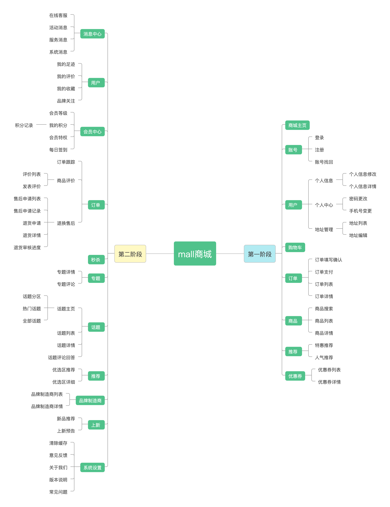
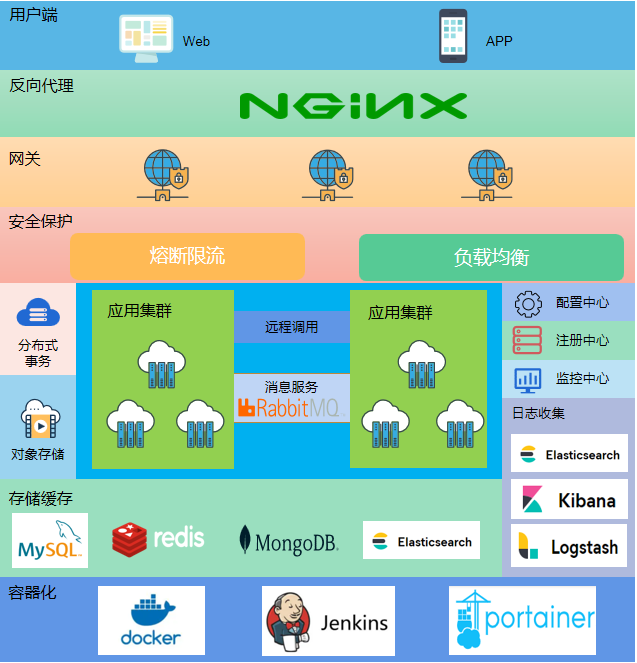

# 开源项目 mall 商城学习（一）

**本阶段学习任务：**

- **对项目功能和架构进行梳理**

- **搭建环境让代码能够顺利运行**

## 系统功能梳理

**根据自己学习情况作出整理：**



## 系统架构图




## 项目环境搭建测试

**说明：项目相关文档中，将数据库MySQL和其他环境同时创建部署，在实际操作过程中，部分组件会在启动时对MySQL数据库有依赖，确切的说是对数据库的schema有依赖，所以，先用Docker安装MySQL，并创建schema。**

### 利用 Docker创建MySQL

#### 方式一：Docker直接拉取相关镜像并运行

##### 拉取镜像

```shell
docker pull mysql:5.7.37
```

##### 运行镜像

```shell
# --name 后面的mysql是自定义容器名，my-secret-pw是MySQL的root账号密码
docker run --name mysql -e MYSQL_ROOT_PASSWORD=my-secret-pw -d mysql:5.7.37
```

#### 方式二：Docker-compose搭建

##### 创建 yaml 文件 *docker-compose-mysql.yaml*

```properties
version: '3'
services:
  mysql:
    image: mysql:5.7
    container_name: mysql
    command: mysqld --character-set-server=utf8mb4 --collation-server=utf8mb4_unicode_ci
    restart: always
    environment:
      MYSQL_ROOT_PASSWORD: root #设置root帐号密码
    ports:
      - 3306:3306
    volumes:
      - /mydata/mysql/data/db:/var/lib/mysql #数据文件挂载
      - /mydata/mysql/data/conf:/etc/mysql/conf.d #配置文件挂载
      - /mydata/mysql/log:/var/log/mysql #日志文件挂载
```

##### Docker-compose执行

```shell
docker-compose -f docker-compose-mysql.yaml up -d
```

执行命令后，docker 会自动拉取相关的镜像，并配置启动。

**注：挂载卷相关文件夹要提前创建**

#### 进入MySQL容器操作，修改host便于远程界面工具访问

```shell
docker exec -it mysql bash
mysql -uroot -p
# 输入密码，进入数据库
# 切换到mysql库
> use mysql
> update user set host = '%' where user = 'root';
> flush privileges;
```

**MySQL 可以远程通过外网访问了**

 [获取更多 docker MySQL 操作]([Docker Hub](https://hub.docker.com/_/mysql))

#### 界面工具连接MySQL，导入sql脚本（略）

### Docker-compose搭建环境

**其他环境镜像较多，分别安装比较耗时，所以使用Docker-compose打包安装**

#### 创建 yaml 配置文件 docker-compose-env.yaml

```properties
version: '3'
services:
  redis:
    image: redis:5
    container_name: redis
    command: redis-server --appendonly yes
    volumes:
      - /mydata/redis/data:/data #数据文件挂载
    ports:
      - 6379:6379
  nginx:
    image: nginx:1.10
    container_name: nginx
    volumes:
      - /mydata/nginx/conf:/etc/nginx #配置文件挂载
      - /mydata/nginx/html:/usr/share/nginx/html #静态资源根目录挂载
      - /mydata/nginx/log:/var/log/nginx #日志文件挂载
    ports:
      - 80:80
  rabbitmq:
    image: rabbitmq:3.7.15-management
    container_name: rabbitmq
    volumes:
      - /mydata/rabbitmq/data:/var/lib/rabbitmq #数据文件挂载
      - /mydata/rabbitmq/log:/var/log/rabbitmq #日志文件挂载
    ports:
      - 5672:5672
      - 15672:15672
  elasticsearch:
    image: elasticsearch:7.6.2
    container_name: elasticsearch
    user: root
    environment:
      - "cluster.name=elasticsearch" #设置集群名称为elasticsearch
      - "discovery.type=single-node" #以单一节点模式启动
      - "ES_JAVA_OPTS=-Xms512m -Xmx512m" #设置使用jvm内存大小
    volumes:
      - /mydata/elasticsearch/plugins:/usr/share/elasticsearch/plugins #插件文件挂载
      - /mydata/elasticsearch/data:/usr/share/elasticsearch/data #数据文件挂载
    ports:
      - 9200:9200
      - 9300:9300
  logstash:
    image: logstash:7.6.2
    container_name: logstash
    environment:
      - TZ=Asia/Shanghai
    volumes:
      - /mydata/logstash/logstash.conf:/usr/share/logstash/pipeline/logstash.conf #挂载logstash的配置文件
    depends_on:
      - elasticsearch #kibana在elasticsearch启动之后再启动
    links:
      - elasticsearch:es #可以用es这个域名访问elasticsearch服务
    ports:
      - 4560:4560
      - 4561:4561
      - 4562:4562
      - 4563:4563
  kibana:
    image: kibana:7.6.2
    container_name: kibana
    links:
      - elasticsearch:es #可以用es这个域名访问elasticsearch服务
    depends_on:
      - elasticsearch #kibana在elasticsearch启动之后再启动
    environment:
      - "elasticsearch.hosts=http://es:9200" #设置访问elasticsearch的地址
    ports:
      - 5601:5601
  mongo:
    image: mongo:4.2.5
    container_name: mongo
    volumes:
      - /mydata/mongo/db:/data/db #数据文件挂载
    ports:
      - 27017:27017
  nacos-registry:
    image: nacos/nacos-server:1.3.0
    container_name: nacos-registry
    environment:
      - "MODE=standalone"
    ports:
      - 8848:8848
```

#### docker-compose执行

```shell
docker-compose -f docker-compose-env.yaml up -d
```


## 四、项目代码运行测试

        微服务项目，子项目众多，分别打包有些不便，借助 Maven 插件，将项目打包后，生成docker 镜像推送到 docker 服务中。

### 配置Docker远程环境

#### 搭建 Docker Registry

```shell
docker run -d -p 5000:5000 --restart=always --name registry2 registry:2
```

docker 会拉取 registry 镜像

#### Docker 开启远程API

修改 docker.service文件：

```shell
vim /usr/lib/systemd/system/docker.service
```

找到

```shell
ExecStart=/usr/bin/dockerd -H fd:// --containerd=/run/containerd/containerd.sock
```

修改为：

```shell
ExecStart=/usr/bin/dockerd -H tcp://0.0.0.0:2375 -H unix://var/run/docker.sock
```

#### 让Docker支持http上传镜像

```shell
echo '{ "insecure-registries":["192.168.3.101:5000"] }' > /etc/docker/daemon.json
```

#### 让配置生效

```shell
systemctl daemon-reload
```

#### 重新启动Docker服务

```shell
systemctl stop docker
systemctl start docker
```

#### 防火墙设置

**若服务器开启了防火墙：**

```shell
firewall-cmd --zone=public --add-port=2375/tcp --permanent
firewall-cmd --reload
```

### 使用Maven构建Docker镜像

在各子项目应用的 pom.xml 文件中添加 docker-maven-plugin 的依赖：

```xml
<plugin>
    <groupId>com.spotify</groupId>
    <artifactId>docker-maven-plugin</artifactId>
    <!-- 这里版本号可能会出现冲突，注释掉即可 -->
    <version>1.1.0</version>
    <executions>
        <execution>
            <id>build-image</id>
            <phase>package</phase>
            <goals>
                <goal>build</goal>
            </goals>
        </execution>
    </executions>
    <configuration>
        <imageName>mall/${project.artifactId}:${project.version}</imageName>
        <dockerHost>http://docker-host:2375</dockerHost>
        <baseImage>java:8</baseImage>
        <entryPoint>["java", "-jar","/${project.build.finalName}.jar"]
        </entryPoint>
        <resources>
            <resource>
                <targetPath>/</targetPath>
                <directory>${project.build.directory}</directory>
                <include>${project.build.finalName}.jar</include>
            </resource>
        </resources>
    </configuration>
</plugin>
```

**配置说明：**

- executions.execution.phase:此处配置了在maven打包应用时构建docker镜像；

- imageName：用于指定镜像名称，mall-tiny是仓库名称，`${project.artifactId}`为镜像名称，`${project.version}`为仓库名称；

- dockerHost：打包后上传到的docker服务器地址；

- baseImage：该应用所依赖的基础镜像，此处为java；

- entryPoint：docker容器启动时执行的命令；

- resources.resource.targetPath：将打包后的资源文件复制到该目录；

- resources.resource.directory：需要复制的文件所在目录，maven打包的应用jar包保存在target目录下面；

- resources.resource.include：需要复制的文件，打包好的应用jar包。

**执行 Maven 的package命令，打包成功后，docker 中会出现相应的镜像。**

### 各子项目在docker中启动

#### 创建 yaml 配置文件 docker-compose-app.yaml

```properties
version: '3'
services:
  mall-admin:
    image: mall/mall-admin:1.0-SNAPSHOT
    container_name: mall-admin
    ports:
      - 8080:8080
    volumes:
      - /mydata/app/mall-admin/logs:/var/logs
      - /etc/localtime:/etc/localtime
    environment:
      - 'TZ="Asia/Shanghai"'
    external_links:
      - mysql:db #可以用db这个域名访问mysql服务
      - nacos-registry:nacos-registry #可以用nacos-registry这个域名访问nacos服务
  mall-search:
    image: mall/mall-search:1.0-SNAPSHOT
    container_name: mall-search
    ports:
      - 8081:8081
    volumes:
      - /mydata/app/mall-search/logs:/var/logs
      - /etc/localtime:/etc/localtime
    environment:
      - 'TZ="Asia/Shanghai"'
    external_links:
      - elasticsearch:es #可以用es这个域名访问elasticsearch服务
      - mysql:db #可以用db这个域名访问mysql服务
      - nacos-registry:nacos-registry #可以用nacos-registry这个域名访问nacos服务
  mall-portal:
    image: mall/mall-portal:1.0-SNAPSHOT
    container_name: mall-portal
    ports:
      - 8085:8085
    volumes:
      - /mydata/app/mall-portal/logs:/var/logs
      - /etc/localtime:/etc/localtime
    environment:
      - 'TZ="Asia/Shanghai"'
    external_links:
      - redis:redis #可以用redis这个域名访问redis服务
      - mongo:mongo #可以用mongo这个域名访问mongo服务
      - mysql:db #可以用db这个域名访问mysql服务
      - rabbitmq:rabbit #可以用rabbit这个域名访问rabbitmq服务
      - nacos-registry:nacos-registry #可以用nacos-registry这个域名访问nacos服务
  mall-auth:
    image: mall/mall-auth:1.0-SNAPSHOT
    container_name: mall-auth
    ports:
      - 8401:8401
    volumes:
      - /mydata/app/mall-auth/logs:/var/logs
      - /etc/localtime:/etc/localtime
    environment:
      - 'TZ="Asia/Shanghai"'
    external_links:
      - nacos-registry:nacos-registry #可以用nacos-registry这个域名访问nacos服务
  mall-gateway:
    image: mall/mall-gateway:1.0-SNAPSHOT
    container_name: mall-gateway
    ports:
      - 8201:8201
    volumes:
      - /mydata/app/mall-gateway/logs:/var/logs
      - /etc/localtime:/etc/localtime
    environment:
      - 'TZ="Asia/Shanghai"'
    external_links:
      - redis:redis #可以用redis这个域名访问redis服务
      - nacos-registry:nacos-registry #可以用nacos-registry这个域名访问nacos服务
  mall-monitor:
    image: mall/mall-monitor:1.0-SNAPSHOT
    container_name: mall-monitor
    ports:
      - 8101:8101
    volumes:
      - /mydata/app/mall-monitor/logs:/var/logs
      - /etc/localtime:/etc/localtime
    environment:
      - 'TZ="Asia/Shanghai"'
    external_links:
      - nacos-registry:nacos-registry #可以用nacos-registry这个域名访问nacos服务
```

#### Docker-compose 启动项目

```shell
docker-compose -f docker-compose-app.yaml up -d
```


